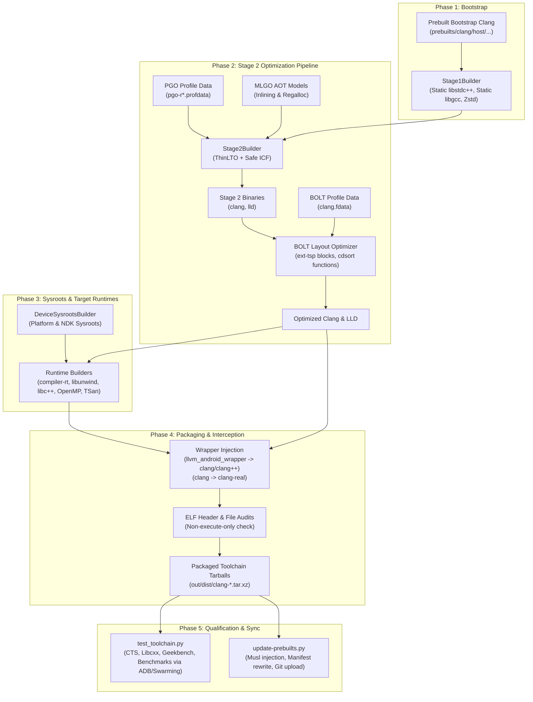

# Architecture of `toolchain/llvm_android`

## High-Level System Purpose

`toolchain/llvm_android` is the build orchestration, optimization, qualification, and release-engineering framework for Google's downstream Clang/LLVM toolchains. It produces hermetic, production-grade compiler toolchains powering four primary targets:

1. **Android Platform (AOSP & Internal OS)**: Core platform build system (Soong/Ninja), APEX runtime modules, Bionic C library, and platform sanitizers (ASan, HWASan, UBSan, TSan).
2. **Linux Kernel (GKI & Android Common Kernels via Kleaf)**: Deterministic Clang toolchain integrated via Bazel/Kleaf rules with dynamic Python interpreter metadata.
3. **Android Native Development Kit (NDK)**: C/C++ developer SDK targeting diverse Android API levels across multiple architectures (AArch64, ARM, RISC-V 64, x86_64, x86) with static and shared target runtimes (`libc++`, `libc++abi`, `libunwind`, compiler-rt).
4. **Baremetal & TEE Environments**: Baremetal targets (e.g. Trusty OS) requiring non-OS runtime builtins and compiler-rt libraries.

---

## Primary Component Responsibilities

The root of `toolchain/llvm_android` coordinates multi-stage compilation, optimization pipelines, hardware qualification, and prebuilt distribution:

### 1. Build Orchestration Driver (`toolchain/llvm_android/do_build.py`)
- **Pipeline Coordinator**: Main CLI entrypoint driving source setup, stage1 bootstrap, stage2 release compilation, target runtimes cross-compilation, Windows cross-compilation, binary stripping, and packaging.
- **Optimization Pipeline**: Orchestrates Profile-Guided Optimization (PGO), Thin Link-Time Optimization (ThinLTO), Machine Learning Guided Optimization (MLGO), and Binary Optimization and Layout Tool (BOLT).
- **Toolchain Interception Wrappers**: Intercepts host compiler calls via Go-based `llvm_android_wrapper` binaries to handle distributed compilation (RBE), bisection dispatch (`bisect_driver.py`), and clang-tidy verification (`clang-tidy.sh`).
- **Packaging & Validation**: Verifies packaged binary/library integrity, extracts distribution tarballs, generates Bazel `BUILD.bazel` definitions, and audits runtime ELF headers.

### 2. Builder Class Hierarchy (`toolchain/llvm_android/src/llvm_android/builders.py`)
- **Host Compilers**:
  - `Stage1Builder`: Builds the bootstrap host Clang using prebuilt compilers; links static runtimes (`-static-libstdc++`, `-static-libgcc`, static zstd) to isolate against host glibc differences.
  - `Stage2Builder`: Builds the production toolchain using the Stage 1 compiler; applies ThinLTO, PGO profdata, embedded MLGO models (for inlining and register allocation eviction), and post-link BOLT layout optimizations.
- **Target Runtimes**:
  - `BuiltinsBuilder`, `LibUnwindBuilder`, `DeviceLibcxxBuilder`, `CompilerRTBuilder`, `TsanBuilder`, and `LibOMPBuilder`: Compile target-specific libraries across Android ABI targets.
  - `MuslHostRuntimeBuilder`: Builds Musl libc++ runtimes to support Musl-based host environments.
- **Sysroot Staging**:
  - `DeviceSysrootsBuilder` & `LFIDeviceSysrootsBuilder`: Prepare target Android platform and NDK sysroots.
  - `HostSysrootsBuilder`: Sets up host sysroots for Windows cross-compilation.
- **Cross-Compilation & Host Tools**:
  - `WindowsToolchainBuilder` & `WinLibCxxBuilder`: Cross-compile Windows LLVM/Clang binaries and runtimes via MinGW or MSVC SDK.
  - `SwigBuilder`, `ZstdBuilder`, `LibXml2Builder`, `LibNcursesBuilder`, `LibEditBuilder`, `XzBuilder`, `LldbServerBuilder`, and `LibSimpleperfReadElfBuilder`: Build ancillary host/device dependencies and debugging servers.

### 3. Architecture & Target Configurations (`toolchain/llvm_android/src/llvm_android/configs.py`)
- **Host Configurations**:
  - `LinuxConfig`: Default glibc host configuration targeting `-march=x86-64-v2`.
  - `LinuxMuslConfig` & `LinuxMuslHostConfig`: Musl-based Linux host configurations enforcing `-rtlib=compiler-rt` and custom stack sizing.
  - `DarwinConfig`: macOS host configuration (`arm64-apple-darwin`).
  - `MinGWConfig` & `MSVCConfig`: Windows cross-compilation configurations.
- **Target Android Configurations**:
  - `AndroidConfig` subclasses (`AndroidARMConfig`, `AndroidAArch64Config`, `AndroidAArch64LFIConfig`, `AndroidRiscv64Config`, `AndroidX64Config`, `AndroidI386Config`): Provide target triples, sysroot paths, API level mappings, and architecture-specific flags (e.g., 16 KiB page alignment for 64-bit architectures).
- **Baremetal Configurations**:
  - `BaremetalConfig` subclasses for AArch64 and ARM Cortex-M variants.

### 4. On-Device Qualification & Benchmarking (`toolchain/llvm_android/test_toolchain.py`)
- **Test Orchestrator**: Automated qualification runner executing test suites on connected or lab-leased hardware (Devices Under Test / DUTs).
- **Lab Integrations**: `Lab` abstraction with `Swarming` implementation driving device leasing via `crosfleet` CLI or direct ADB connections (`adb_serial`, `adb_infer`).
- **DUT Stabilization (`prep_dut_for_test.sh`)**: Stabilizes devices prior to benchmarks (reboot, root, lock CPU/GPU frequencies, disable thermal throttling).
- **Supported Test Suites**:
  - CTS: `CtsBionicTestCases` (`CTS_BIONIC`), `CtsLibcoreTestCases` (`CTS_LIBCORE`).
  - Native Benchmarks: Bionic benchmarks (`BENCH_BIONIC`), Libcore benchmarks (`BENCH_LIBCORE`).
  - Runtimes & Third-Party: On-device Libcxx LIT test suite (`LIBCXX`), Geekbench 6 (`GEEKBENCH`).

### 5. Prebuilt Distribution Synchronization (`toolchain/llvm_android/update-prebuilts.py`)
- **Release Automation**: Downloads candidate toolchain tarballs from continuous build servers (`/google/bin/releases/android/ab/ab.par` or fetch APIs).
- **Musl Ingestion**: Extracts companion `linux_musl-x86` artifacts (including Musl libc, libc++, and jemalloc5) into Linux toolchain prebuilts.
- **Manifest Sanitization (`rewrite_manifest`)**: Rewrites build manifest files from internal `goog` remotes to public AOSP remotes (`https://android.googlesource.com/`) and prepends `mirror-goog-` tags to revisions/upstreams before committing to public branches.
- **Sanity Audits (`validity_check`)**: Asserts production binaries possess required optimization markers (`+pgo`, `+bolt`, `+lto`, `+mlgo`) and validates `remote_toolchain_inputs`.

### 6. Prebuilt Host Targets & Output Directory Structure
The build system outputs, installs, and synchronizes prebuilt compiler artifacts according to the following directory topography:

```
<Android Root>/
├── prebuilts/clang/host/
│   ├── linux-x86/             # Bootstrap compiler and Linux x86_64 host prebuilts
│   ├── linux-arm64/           # Linux AArch64 host prebuilts
│   ├── darwin-x86/            # macOS host prebuilts (universal binaries)
│   └── windows-x86/           # Windows host prebuilts (cross-compiled)
└── out/
    ├── install/               # Final packaged prebuilts shipped to prebuilts/
    │   ├── linux-x86/         # Linux host toolchain install tree
    │   ├── darwin-x86/        # Darwin host toolchain install tree
    │   └── windows-x86/       # Windows host toolchain install tree
    ├── stage1-install/        # Stage 1 bootstrap compiler prefix
    ├── stage2-install/        # Stage 2 production compiler prefix
    └── dist/                  # Packaged distribution tarballs (.tar.xz)
```

---

## Core Architecture & Data Flow



---

## Key Public Entry Points & Interfaces

### 1. CLI Entry Points
- **`do_build.py`**:
  - `--preset {release,fast,debug,bootstrap,musl}`: Selects baseline build configuration profiles.
  - `--lto` / `--no-lto`: Toggles ThinLTO optimization for Stage 2.
  - `--pgo` / `--no-pgo`: Ingests profile data (`extract_pgo_profile()`) for PGO optimization.
  - `--bolt` / `--no-bolt` / `--bolt-instrument`: Toggles BOLT post-link layout optimization or instrumentation profiling.
  - `--mlgo`: Integrates TensorFlow machine-learning guided compiler optimization models.
  - `--musl`: Compiles Linux host binaries using the Musl C library sysroot.
  - `--build-llvm-next`: Tags build as experimental candidate tracking upstream changes.
- **`test_toolchain.py`**:
  - `python3 test_toolchain.py -a <android-root> -o <out-dir> <config.yaml>`: Dispatches DUT execution for hardware qualification.
- **`update-prebuilts.py`**:
  - `python3 update-prebuilts.py <build_number> [-b <bug>] [--host <host>] [--repo-upload]`: Synchronizes prebuilt repositories with CI build server outputs.

### 2. Wrapper Execution Layer (`install_wrappers`)
When deployed to `bin/`, compiler executables are structured to allow non-invasive interception:
- Original compiler binaries are moved to `clang-real`, `clang++-real`, and `clang-tidy-real`.
- Go-based wrapper binary (`llvm_android_wrapper` from `external/toolchain-utils/compiler_wrapper`) is copied to `clang`, `clang++`, and `clang-tidy`.
- `clang-cl` is symlinked directly to `clang-real` to preserve MSVC CLI compatibility.
- Bisection helper `bisect_driver.py` and runner `clang-tidy.sh` are co-located in `bin/`.

---

## Critical Invariants & Operational Constraints

1. **BOLT Prerequisites**:
   Enabling BOLT optimization requires PGO and ThinLTO to be active (`pgo and lto and (mlgo or musl)`). BOLT is strictly prohibited on Darwin hosts due to Mach-O binary limitations.
2. **AArch64 Non-Execute-Only Runtime Guard**:
   `check_execute_only_runtime_libraries()` inspects ELF program headers of AArch64 Android shared runtime libraries (`libclang_rt.asan*`, `libclang_rt.hwasan*`, `libclang_rt.ubsan*`, `libclang_rt.tsan*`, and `libc++.so`). It raises a `RuntimeError` if any segment is marked execute-only (`flags == "E"`), protecting compatibility with HWASan memory tagging.
3. **ThinLTO Parallel Link Limit**:
   To prevent link-time out-of-memory crashes on high-core build machines, `Stage2Builder` clamps link concurrency via `LLVM_PARALLEL_LINK_JOBS = min(int(multiprocessing.cpu_count() / 2), 16)`.
4. **Android 16 KiB Page Size Alignment**:
   64-bit Android targets (`AArch64`, `AArch64_LFI`, `X86_64`) enforce 16 KiB memory page boundaries using linker flags `-Wl,-z,max-page-size=16384` and `-Wl,-z,common-page-size=16384`, combined with `-D__BIONIC_NO_PAGE_SIZE_MACRO`.
5. **Musl Stack Sizing**:
   `LinuxMuslConfig` explicitly injects `-Wl,-z,stack-size=2097152` (2 MiB) to override Musl's minimal default thread stack size (typically 128 KiB), preventing stack overflows during complex compiler passes.
6. **Prebuilt Manifest Sanitization**:
   `update-prebuilts.py` enforces rewriting XML repository manifests: remote names must change from internal `goog` to `aosp` pointing to `https://android.googlesource.com/`, with default revisions and project upstreams prefixed by `mirror-goog-`.

---

> Recorded Revision Hash: c58dd95f2b4669ed109b04b9a2b8e73e1f6f98ef
