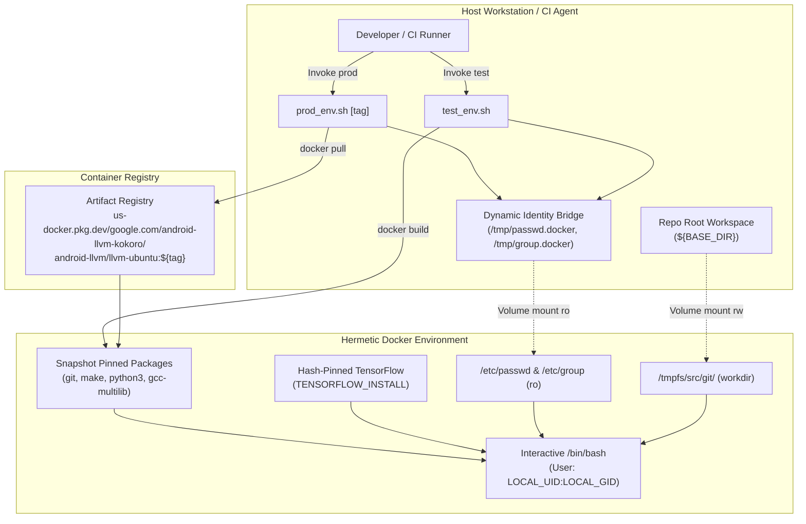

# Architecture: Android LLVM Docker Environment

## Overview & Purpose

The `toolchain/llvm_android/docker` component provides a hermetic, standardized Linux container environment for building, testing, and packaging the Android LLVM/Clang toolchain. It ensures identical build and test conditions across local developer workstations and CI/CD pipelines (including Kokoro buildbots and automated LLDB testing).

By isolating builds within a strictly pinned Ubuntu container, the environment prevents host distribution drift, eliminates reliance on unversioned host packages, and standardizes dependencies required for Machine Learning-Guided Compiler Optimizations (MLGO) and multi-target testing.

## Component Responsibilities

| File | Primary Responsibility |
| --- | --- |
| `toolchain/llvm_android/docker/Dockerfile` | Defines the container image specification: pinned base image, APT snapshot date, system packages, hash-pinned Python packages, MLGO environment variables, and Git bot identity. |
| `toolchain/llvm_android/docker/prod_env.sh` | Production entry script: pulls the published container image from Cloud Artifact Registry, bridges host UID/GID into container passwd/group databases, mounts the workspace, and launches an interactive shell. |
| `toolchain/llvm_android/docker/test_env.sh` | Local developer testing entry script: builds a local image (`llvm-ubuntu-dev`) from the local `Dockerfile`, applies UID/GID bridging, and drops the user into an interactive development container. |
| `toolchain/llvm_android/docker/README.md` | Documents developer workflows, remote image deployment via Google Cloud Build, Artifact Registry tagging, and Python dependency management via `pip-tools`. |

## Architecture & Data Flow

### Core Mechanisms

1. **Multi-Level Immutability & Reproducibility**:
   - **Base Image Pinning**: Fixed directly to an immutable digest (`ubuntu@sha256:c35e29c9450151419d9448b0fd75374fec4fff364a27f176fb458d472dfc9e54`).
   - **APT Snapshot Freezing**: Configures `APT::Snapshot "20260325T000000Z"` in `/etc/apt/apt.conf.d/50snapshot` so package updates retrieve fixed-in-time upstream package revisions.
   - **Hash-Pinned Python Dependencies**: Installs TensorFlow for MLGO using `pip install --break-system-packages --require-hashes` against pinned checksums in `requirements.txt`.
2. **Dynamic Identity Bridging (Non-Root Execution)**:
   - Host wrapper scripts (`prod_env.sh` and `test_env.sh`) determine caller credentials (`LOCAL_UID=$(id -u)`, `LOCAL_GID=$(id -g)`).
   - Temporary user and group definitions are written to `/tmp/passwd.docker` and `/tmp/group.docker` and mounted read-only over `/etc/passwd` and `/etc/group`.
   - Containers run under `--user ${LOCAL_UID}:${LOCAL_GID}`. This prevents container operations from producing root-owned output files on the host filesystem and avoids permission anomalies during filesystem-sensitive runtime test suites (e.g. libc++ tests).
3. **Hermetic Host Boundary**:
   - Compilers (`clang`, `gcc`), build systems (`ninja`, `cmake`), and caching tools (`sccache`) are intentionally excluded from system package installation. Build scripts rely exclusively on verified prebuilts checked into the Android repository tree.

## Key Public Interfaces & Entry Points

- **`toolchain/llvm_android/docker/prod_env.sh [tag]`**:
  - Pulls and runs image `us-docker.pkg.dev/google.com/android-llvm-kokoro/android-llvm/llvm-ubuntu:${tag:-prod}`.
  - Mounts repository root into `/tmpfs/src/git/`.
- **`toolchain/llvm_android/docker/test_env.sh`**:
  - Locally builds and runs `llvm-ubuntu-dev` from `toolchain/llvm_android/docker/Dockerfile`.
  - Used for local iteration when modifying Dockerfile configurations or Python dependency sets.
- **Environment Variables**:
  - `TENSORFLOW_INSTALL`: Exported as `/usr/local/lib/python3.12/dist-packages/tensorflow` to locate TensorFlow C/C++ libraries during LLVM MLGO builds.

## Critical Invariants

- **Relative Workspace Location**: Scripts compute repo root relative to the script location (`BASE_DIR=$(dirname ${SCRIPT_DIR})/../..`) and map it to `/tmpfs/src/git/`.
- **Reproducible Python Constraints**: Any update to Python dependencies must be compiled with `--generate-hashes` using `pip-tools` and stripped of conflicting system wheels.
- **Git User Identification**: `/etc/gitconfig` contains a pre-configured bot identity (`Builder`, `android-llvm+build@google.com`) satisfying `repo` synchronization prerequisites inside non-interactive containers.

> Recorded Revision Hash: c58dd95f2b4669ed109b04b9a2b8e73e1f6f98ef
