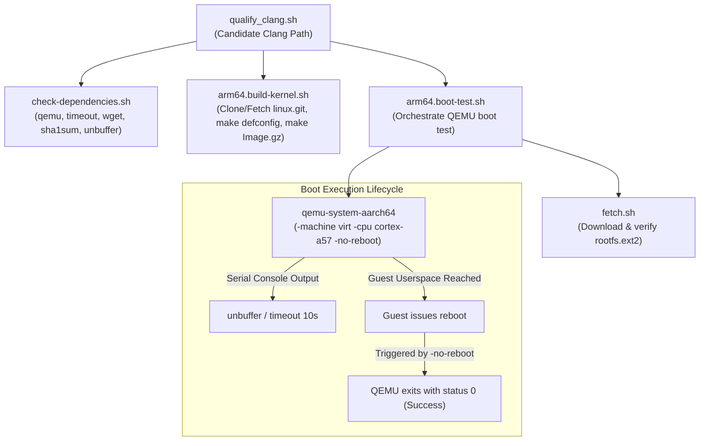

# Kernel Boot Tests (`kernel-boot-tests`)

## 1. Overview & Purpose
`kernel-boot-tests` is a standalone developer verification harness within `toolchain/llvm_android/kernel-boot-tests` designed to validate candidate Clang toolchains against upstream Linux kernels.

The harness addresses toolchain regressions that produce non-bootable kernels (such as ARM64 target triple inference failures or thread-local storage stack-protector hook breakages). It automates cloning upstream Linux mainline, cross-compiling an ARM64 kernel (`Image.gz`) with the candidate Clang compiler, and executing an end-to-end boot test in QEMU against a minimal root filesystem.

## 2. Architecture & Workflow

The harness is structured as a collection of modular POSIX/Bash scripts orchestrated by `qualify_clang.sh`.

### Execution Stages
1. **Preflight Dependency Verification**: `check-dependencies.sh` ensures all required host binaries (`qemu-system-aarch64`, `timeout`, `wget`, `sha1sum`, `unbuffer`) are installed and discoverable in `PATH`.
2. **Kernel Fetch & Cross-Compilation**: `arm64.build-kernel.sh` clones or updates a shallow copy (`--depth 1`) of the upstream Linux kernel tree, configures an ARM64 defconfig, and builds the compressed kernel image using the candidate Clang binary.
3. **Root Filesystem Ingestion**: `arm64.boot-test.sh` invokes `fetch.sh` to download and verify a prebuilt ARM64 ext2 root filesystem.
4. **QEMU Virtualized Boot**: `arm64.boot-test.sh` launches `qemu-system-aarch64` under `unbuffer` with a 10-second timeout. Successful userspace initialization triggers an automatic guest reboot, causing QEMU to terminate cleanly with exit code 0.

## 3. Subsystem Components & Responsibilities

| Script Path | Primary Responsibility | Key Inputs / Invariants |
| :--- | :--- | :--- |
| `toolchain/llvm_android/kernel-boot-tests/qualify_clang.sh` | Main orchestration entry point. Validates candidate Clang argument and executes build and boot stages sequentially. | Input: Path to candidate `clang` executable. Flags: `set -exu`. |
| `toolchain/llvm_android/kernel-boot-tests/check-dependencies.sh` | Host prerequisite validator. | Requires: `qemu-system-aarch64`, `timeout`, `wget`, `sha1sum`, `unbuffer` (from the `expect` package). |
| `toolchain/llvm_android/kernel-boot-tests/arm64.build-kernel.sh` | Kernel acquisition and compilation pipeline. | Resolves absolute compiler path via `readlink -f`. Clones shallow `linux.git` tree if absent; fetches latest `origin/master` if present. Environment: `ARCH=arm64`, `CROSS_COMPILE=aarch64-linux-gnu-`. Targets: `make mrproper`, `make defconfig`, `make -j$(nproc)`. Output: `linux/arch/arm64/boot/Image.gz`. |
| `toolchain/llvm_android/kernel-boot-tests/arm64.boot-test.sh` | QEMU virtual machine test harness. | Invokes `fetch.sh` to stage `arm64.rootfs.ext2`. QEMU parameters: `-machine virt`, `-cpu cortex-a57`, `-m 512`, `-nographic`, `-no-reboot`. Kernel bootargs: `console=ttyAMA0 earlyprintk=ttyAMA0 root=/dev/vda`. |
| `toolchain/llvm_android/kernel-boot-tests/fetch.sh` | Idempotent asset downloader and verification helper. | Fetches gzipped archives via `wget`, validates SHA-1 checksum of the raw compressed archive, and decompresses via `gunzip`. Skips download if uncompressed target exists. |

## 4. Key Invariants & Operational Semantics

- **Reboot as Success Oracle**: The root filesystem image (`arm64.rootfs.ext2`) is configured to issue a reboot command immediately upon reaching userspace init. When coupled with QEMU's `-no-reboot` flag, this cleanly terminates the emulator process with an exit status of 0. Any boot hang, kernel panic, or instruction fault prevents the reboot command from executing, causing `timeout 10s` to kill the process with a non-zero exit code.
- **Rootfs Checksum Immutability**: `fetch.sh` validates the SHA-1 digest (`dbe4136f0b4a0d2180b93fd2a3b9a784f9951d10`) against the downloaded compressed archive (`rootfs.ext2.gz`) rather than the uncompressed filesystem. Because ext2 filesystem metadata is mutated during read-write boot execution, caching the uncompressed file and checking existence (`[[ ! -e $output_filename ]]`) prevents checksum mismatch errors on subsequent runs.
- **Path Resolution Across Subdirectories**: `arm64.build-kernel.sh` calls `readlink -f` on the compiler argument prior to changing into the `linux/` directory, ensuring relative paths passed to `qualify_clang.sh` remain valid during kernel compilation.
- **Developer-Only Lifecycle**: The test suite operates strictly as a manual developer verification tool and is decoupled from Android platform build systems (Soong/Kati) and continuous integration presubmit bots.

> Recorded Revision Hash: c58dd95f2b4669ed109b04b9a2b8e73e1f6f98ef
