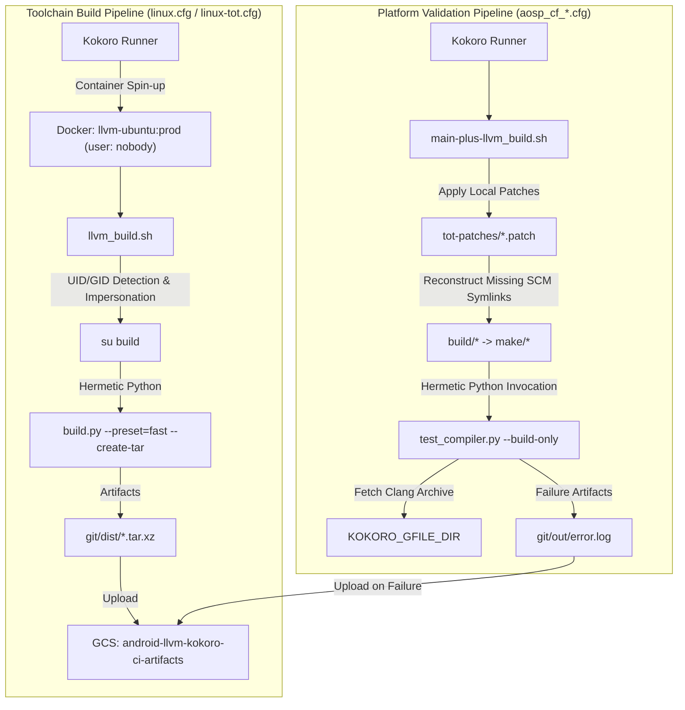

# LLVM Kokoro CI Subsystem

## System Purpose & Overview
The `toolchain/llvm_android/kokoro` subsystem defines continuous integration (CI) jobs executed on Google Kokoro runners for the Android LLVM/Clang toolchain. It manages two distinct execution pipelines:
1. **Toolchain Build Pipeline**: Compiles compiler binaries and runtime libraries (`clang`, `compiler-rt`, `libcxx`) for Linux hosts across `linux-main` and upstream top-of-tree (`linux-TOT`) configurations.
2. **Platform Validation Pipeline (`main-plus-llvm`)**: Validates prebuilt Clang packages against full Android OS platform targets (`aosp_cf_*` Cuttlefish devices) to detect ABI breakages, compiler crashes, or regressions prior to toolchain promotion.

---

## Architecture & Data Flow



---

## Primary Component Responsibilities

| File / Component | Purpose | Key Inputs & Invocations |
| :--- | :--- | :--- |
| `toolchain/llvm_android/kokoro/common.cfg` | Common Kokoro container configuration | Defines Docker image `us-docker.pkg.dev/google.com/android-llvm-kokoro/android-llvm/llvm-ubuntu:prod` running under unprivileged user `nobody`. |
| `toolchain/llvm_android/kokoro/linux.cfg` | Release branch CI configuration | Sets `LLVM_BUILD_TYPE="linux-main"`, triggers `llvm_build.sh`, and archives `git/dist/*`. |
| `toolchain/llvm_android/kokoro/linux-tot.cfg` | Upstream Top-of-Tree CI configuration | Sets `LLVM_BUILD_TYPE="linux-TOT"`, triggers `llvm_build.sh`, and archives `git/dist/*`. |
| `toolchain/llvm_android/kokoro/llvm_build.sh` | Toolchain build driver script | Handles Docker UID/GID impersonation via `su build`; executes `toolchain/llvm_android/build.py` with `--preset=fast`, `--create-tar`, and `--no-build=windows,lldb`. |
| `toolchain/llvm_android/kokoro/aosp_cf_*.cfg` | Platform validation target configurations | Configures target device variants (`aosp_cf_arm64_phone`, `aosp_cf_arm64_phone_fullmte`, `aosp_cf_arm64_phone_hwasan`, `aosp_cf_riscv64_phone`, `aosp_cf_x86_64_phone`), sets 240m timeout, and collects `git/out/error.log`. |
| `toolchain/llvm_android/kokoro/main-plus-llvm_build.sh` | Android OS validation driver script | Applies transient compatibility patches, restores manifest build symlinks, and invokes `toolchain/llvm_android/test_compiler.py`. |
| `toolchain/llvm_android/kokoro/tot-patches/` | Transient patch store | Contains temporary patches (e.g. `b537780818-bindgen-crash.patch`) needed to build Android platform with bleeding-edge upstream Clang before platform fixes merge. |

---

## Key Interfaces & Execution Entry Points

### 1. Toolchain Build Entry Point (`llvm_build.sh`)
- **Environment Variables**:
  - `LLVM_BUILD_TYPE`: Determines branch build mode (`linux-main` or `linux-TOT`).
  - `KOKORO_BUILD_NUMBER`: Passed to `--build-name` for artifact versioning.
- **Flag Semantics**:
  - `--preset=fast`: Bypasses long multi-stage profile-guided optimizations (PGO/ThinLTO) for rapid CI turnarounds.
  - `--build-llvm-next`: Enabled exclusively under `linux-TOT` to pull the latest upstream LLVM commit.
  - `--no-build=windows,lldb`: Disables non-Linux host targets and debugger binaries to minimize build time.

### 2. Validation Entry Point (`main-plus-llvm_build.sh`)
- **Environment Variables**:
  - `AOSP_BUILD_TARGET`: Device architecture target (e.g. `aosp_cf_arm64_phone`).
  - `KOKORO_GFILE_DIR`: Path containing pre-packaged Clang toolchain tarballs.
- **Invocation**:
  ```bash
  prebuilts/python/linux-x86/bin/python3 \
    toolchain/llvm_android/test_compiler.py --build-only \
    --target ${AOSP_BUILD_TARGET}-aosp_current-userdebug \
    --module sync \
    --clang-package-path ${KOKORO_GFILE_DIR} .
  ```

---

## Critical Invariants & Constraints

1. **Unprivileged Docker UID/GID Alignment**:
   Kokoro launches the Docker container under unprivileged user `nobody` (or UID 0 without mapped user namespaces). `toolchain/llvm_android/kokoro/llvm_build.sh` dynamically inspects the file owner of the source root (`stat -c '%u'` and `stat -c '%g'`), adds a `build` group/user matching those IDs, and re-executes via `su build`. This prevents workspace file ownership corruption on the persistent host.
2. **Explicit SCM Symlink Reconstruction**:
   Under Kokoro BCID Level 3 migration, repositories are checked out directly via `git_on_borg_scm` rather than `repo sync`. Because Android platform build files rely on symlinks created by `repo` manifests, `toolchain/llvm_android/kokoro/main-plus-llvm_build.sh` must recreate the required symlinks before initiating platform builds:
   - `build/CleanSpec.mk` &rarr; `build/make/CleanSpec.mk`
   - `build/buildspec.mk.default` &rarr; `build/make/buildspec.mk.default`
   - `build/core` &rarr; `build/make/core`
   - `build/envsetup.sh` &rarr; `build/make/envsetup.sh`
   - `build/target` &rarr; `build/make/target`
   - `build/tools` &rarr; `build/make/tools`
3. **Hermetic Prebuilt Python**:
   All scripts invoke the tree's prebuilt Python binary (`prebuilts/python/linux-x86/bin/python3`), strictly isolating build orchestration from host runner OS packages.
4. **Transient Patch Governance**:
   `tot-patches/` acts as an out-of-band compatibility shim. Changes in LLVM upstream that break Android platform components are isolated here as `.patch` files and applied via `patch -p1` until upstream platform fixes can be merged.

---

> Recorded Revision Hash: c58dd95f2b4669ed109b04b9a2b8e73e1f6f98ef
