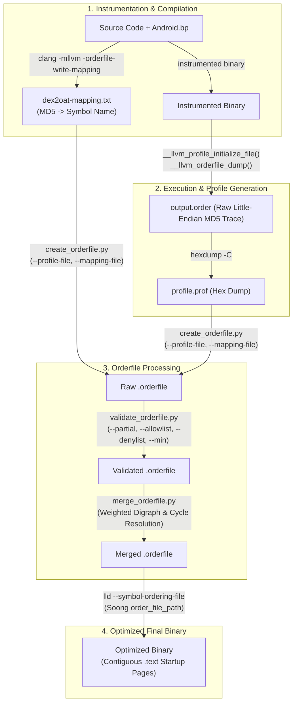

# LLVM Orderfiles

## Overview
The `orderfiles` subsystem in `toolchain/llvm_android/orderfiles` provides the toolchain and scripts required for profile-guided function reordering in Android native executables and shared libraries (such as ART's `dex2oat`).

During execution, scattered functions in an executable's `.text` segment cause excessive page faults and instruction TLB misses during binary startup. By recording a runtime function execution trace and supplying an ordered symbol list (`.orderfile`) to the LLVM Linker (`lld`) via `-Wl,--symbol-ordering-file` (or Soong's `orderfile` module property), frequently executed startup functions are placed into contiguous memory pages, substantially reducing cold-start page faults and improving process launch latency.

## Architecture & Data Flow



## Primary Component Responsibilities

| Script / Module | Path | Core Responsibilities |
| :--- | :--- | :--- |
| `create_orderfile.py` | `toolchain/llvm_android/orderfiles/scripts/create_orderfile.py` | Parses hex-dumped runtime profile traces, reverses 8-byte Little-Endian MD5 byte slices (`md5_1_b_list`, `md5_2_b_list`), resolves them against compiler MD5-to-symbol mapping tables, applies denylists, truncates at startup cutoffs (`--last-symbol`), and appends uncalled symbols (`--leftover`). |
| `validate_orderfile.py` | `toolchain/llvm_android/orderfiles/scripts/validate_orderfile.py` | Asserts ordering correctness: ensures allowlisted symbols are present, denylisted symbols are absent, minimum symbol count thresholds (`--min`) are met, and partial ordering sequences (`--partial`) are preserved (`new_index >= old_index`). |
| `merge_orderfile.py` | `toolchain/llvm_android/orderfiles/scripts/merge_orderfile.py` | Fuses multiple orderfiles across diverse runs or device tiers into a single layout. Constructs a weighted directed graph (`Graph`), detects cycles (`Graph.getCycles`), severs cycle edges targeting nodes with maximum external in-degree weight, and linearizes symbols using greedy weight-prioritized DFS (`printOrder`). |
| `orderfile_utils.py` | `toolchain/llvm_android/orderfiles/scripts/orderfile_utils.py` | Shared utility module for polymorphic CLI parsing (`@file.txt`, `^folder/*.orderfile`, CSV strings), subprocess invocation (`check_call`, `check_output`, `check_error`), and repository root location (`android_build_top`). |

## Key Interfaces & Entry Points

### 1. Runtime Instrumentation Hooks (`README.md`)
Binaries compiled with orderfile instrumentation must invoke compiler-rt runtime hooks at process exit or after completion of startup:
- `__llvm_profile_set_filename(const char *Name)`: Sets profile output target name.
- `__llvm_profile_initialize_file(void)`: Initializes file descriptors for profile output.
- `__llvm_orderfile_dump(void)`: Dumps 64-bit Little-Endian MD5 function execution sequences into `.order`.

### 2. Soong Build System Integration (`Android.bp`)
Controlled via the `orderfile` struct within `cc_binary` or `art_cc_binary`:
```bp
orderfile: {
    instrumentation: true,
    load_order_file: true,
    order_file_path: "dex2oat.orderfile",
}
```

### 3. Pipeline CLI Tools
- **`create_orderfile.py`**:
  - `--profile-file`: Path to the parsed hex profile trace.
  - `--mapping-file`: Path to compiler MD5 symbol mapping file.
  - `--output`: Resulting orderfile path (defaults to `default.orderfile`).
  - `--denylist`: Comma-separated symbol list or `@file` to exclude.
  - `--last-symbol`: Cease output once the specified startup symbol is reached.
  - `--leftover`: Append symbols present in mapping file but absent from the profile.
- **`validate_orderfile.py`**:
  - `--order-file`: Target orderfile to validate.
  - `--partial`: Sequence of symbols that must strictly maintain relative order.
  - `--allowlist`: Mandatory symbols that must exist in the orderfile.
  - `--denylist`: Forbidden symbols (takes precedence over allowlist).
  - `--min`: Minimum entry count threshold.
- **`merge_orderfile.py`**:
  - `--order-files`: Input collection: `@file` (with custom weights), `^folder` (auto-globbed with weight 1), or CSV string.
  - `--output`: Output unified orderfile name.
  - `--graph-image`: Optional Graphviz DOT/PDF export for visual inspection.

## Critical Invariants & Algorithmic Principles

1. **Little-Endian MD5 Trace Decoding**:
   The instrumented profile stream outputs 64-bit MD5 hashes as 8-byte Little-Endian sequences (`md5_1_b_list = line[1:9]`, `md5_2_b_list = line[9:17]`). `create_orderfile.py` reverses both 8-byte lists to recover the big-endian hex keys present in the compiler's mapping file.
2. **Denylist Precedence**:
   In both `create_orderfile.py` and `validate_orderfile.py`, denylists take strict precedence over mapping matches or allowlists (`allowlist.difference(inter)`). Any presence of a denylisted symbol during validation immediately raises a `RuntimeError`.
3. **External In-Degree Cycle Breaking**:
   When combining conflicting execution orders from different runs, cycles are formed in the directed graph. `merge_orderfile.py` computes the external in-degree weight (`inner_weights`) for every node in a cycle—summing incoming edge weights originating strictly outside the cycle. It eliminates the incoming cycle edge targeting the vertex with the highest external weight (`max(inner_weights)`), because that vertex has the strongest alternate ordering anchors in the wider graph.
4. **Greedy Weight-Prioritized Linearization**:
   Linearization begins at root vertices (nodes with zero in-degree) and performs a depth-first search (`__printOrderUtil`). At each vertex, outgoing edges are sorted descending by transition weight (`out_edges.sort(key=lambda x: x[1], reverse=True)`), ensuring that the most frequent transitions across high-weighted profiles are placed contiguously in the final symbol layout.

> Recorded Revision Hash: c58dd95f2b4669ed109b04b9a2b8e73e1f6f98ef
