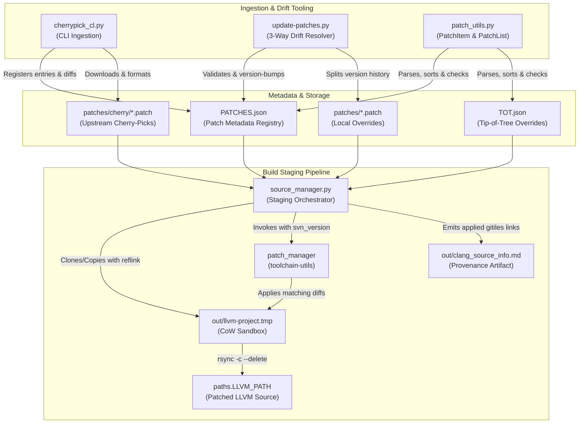

# LLVM Android Patch Governance Architecture

The `toolchain/llvm_android/patches` subsystem constitutes the declarative patch governance repository and build-staging bridge for Google's Android LLVM/Clang compiler toolchain. Rather than maintaining a permanent downstream fork of the upstream LLVM project (`toolchain/llvm-project`), Android utilizes an out-of-tree delta layer consisting of discrete Git unified diff files (`.patch`), a centralized metadata registry (`PATCHES.json`), and automation tooling to version-gate, apply, and retire downstream modifications.

---

## 1. System Purpose & Lifecycle Model

The patch subsystem decouples Android-specific toolchain requirements (such as Bionic C library integration, sanitizer adjustments, debugger stability, and optimization tuning) from the upstream compiler baseline. Every patch is tracked with explicit version bounds mapped to upstream Subversion/Git commit sequence numbers (`svn_revision`):

- **Upstream Cherry-Picks (`cherry/<sha>.patch`)**: Bounded by half-open intervals `[from, until)`. The `from` revision represents the base LLVM version where the patch is first introduced, and `until` corresponds to the upstream SVN revision where the fix landed upstream. Once the toolchain rebases to or past `until`, the patch naturally expires and is pruned.
- **Local Downstream Overrides**: Local modifications (e.g. `move-cxa-demangle-into-libcxxdemangle.patch`, `Add-cmake-c-cxx-asm-linker-flags-v2.patch`) specify `until: null`. These remain active across rebase cycles and evolve via version-suffixed files (e.g. `-v2`, `-v3`) when upstream source drift causes merge conflicts.
- **ToT Patches (`TOT.json`)**: Supplemental patch set applied exclusively when building against tip-of-tree LLVM (`is_llvm_next()`).

```
                    ┌────────────────────────┐
                    │ Upstream LLVM / GitHub │
                    └───────────┬────────────┘
                                │ (cherrypick_cl.py)
                                ▼
                   ┌──────────────────────────┐
                   │ patches/cherry/*.patch   │
                   │ patches/PATCHES.json     │
                   └────────────┬─────────────┘
                                │
        ┌───────────────────────┴───────────────────────┐
        │ (update-patches.py: drift & rebase)           │ (source_manager.py: build staging)
        ▼                                               ▼
┌───────────────────────────────┐               ┌───────────────────────────────┐
│ Git 3-Way Merge & Offset Test │               │ out/llvm-project.tmp Staging  │
│ (git apply --check / git am)  │               │ (external/toolchain-utils)    │
│ Version Bump: name-v{N}.patch │               └───────────────┬───────────────┘
└───────────────────────────────┘                               │ rsync -c --delete
                                                                ▼
                                                ┌───────────────────────────────┐
                                                │ Final Toolchain Source Tree   │
                                                │ (paths.LLVM_PATH)             │
                                                │ + out/clang_source_info.md    │
                                                └───────────────────────────────┘
```

---

## 2. Component Architecture & Data Flow

The patch system consists of the metadata specification, patch artifacts, and execution scripts in `toolchain/llvm_android`:



### Core Components

1. **Metadata Registry (`toolchain/llvm_android/patches/PATCHES.json`)**:
   Maintains a JSON array of patch records conforming to the `PatchItem` schema:
   - `metadata.title`: Brief descriptive subject (e.g. `[UPSTREAM] ...`).
   - `metadata.info`: Optional contextual notes or bug references.
   - `platforms`: Target platforms (typically `["android"]`).
   - `rel_patch_path`: Path relative to `toolchain/llvm_android/patches/`.
   - `version_range`: Bounds object containing integer keys `from` and `until` (nullable).

2. **Patch Utilities (`toolchain/llvm_android/src/llvm_android/patch_utils.py`)**:
   - `PatchItem`: Dataclass encapsulating an individual patch record. Implements `sort_key` to establish deterministic ordering: upstream patches sort by ascending `until` version; open-ended upstream patches sort next by `from` version; local persistent patches anchor at the tail, preserving their insertion order.
   - `PatchList`: Specialization of Python `list` providing serialization (`load_from_file`, `save_to_file`) and structural validation (`check_patches`). Enforces presence of `start_version`, invariant `end_version > start_version`, patch file presence on disk, and patch file uniqueness.

3. **Source Staging & Application (`toolchain/llvm_android/src/llvm_android/source_manager.py`)**:
   - `setup_temp_llvm_project()`: Copies `toolchain/llvm-project` into temporary scratch storage `out/llvm-project.tmp` utilizing copy-on-write (`--reflink=auto` on Linux, `-c` on Darwin) to avoid modifying upstream Git objects.
   - `apply_patches()`: Executes `external/toolchain-utils/llvm_tools/patch_manager` passing `--svn_version`, `--patch_metadata_file`, and `--src_path`. Filters patches satisfying `patch.from <= svn_version < patch.until`.
   - `write_source_info()`: Scrapes patch application output into `out/clang_source_info.md`, indexing each patch to canonical Gitiles URLs on `android.googlesource.com` alongside the base LLVM revision.
   - Timestamp-Preserving Sync: Performs `rsync -r --delete --links -c` from temporary staging to `paths.LLVM_PATH`. Checksum-based comparison ensures untouched files retain their modification timestamps, avoiding invalidating Ninja build caches during incremental compilation.

4. **Ingestion CLI (`toolchain/llvm_android/cherrypick_cl.py`)**:
   - Fetches upstream commits via Git SHA (`--sha`), PR number (`--pr`), or upstream revert (`--revert-sha`).
   - Translates Git commits to unified diffs via `git format-patch -1 <sha> --stdout`.
   - Maps commit SHA to upstream SVN revision (`sha_to_revision()`) to set the `until` ceiling.
   - Verifies patch cleanly applies via dual validation (`git am` and `patch`) before generating standard Gerrit commit messages.

5. **Drift Resolution CLI (`toolchain/llvm_android/update-patches.py`)**:
   - Evaluates active patches against the current toolchain SVN revision using `git apply --check`.
   - On contextual drift, applies patches via `git am --3way --keep-non-patch` and extracts refreshed diffs with `git format-patch -1 HEAD`.
   - Splits version history in `PATCHES.json`: the retiring patch's `until` is capped at `curr_version`, and the newly created patch (`<name>-v<N>.patch`) receives `from = curr_version`.
   - Transactional error handling: If 3-way merge conflicts emerge, updates are paused, state is recorded in `tmp-update-patches.out` via `LastPatchError`, allowing the engineer to resolve conflicts manually and resume with `--continue_script`.

---

## 3. Patch Taxonomy

Patches in the repository fall into two structural classes:

| Class | Location | Bounding Interval | Evolution & Retirement |
| :--- | :--- | :--- | :--- |
| **Upstream Cherry-Picks** | `patches/cherry/*.patch` | Bounded: `[from, until)` where `until` is the upstream SVN revision. | Automatically retired by `trim_patch_data.py` once the base LLVM rebase revision exceeds `until`. |
| **Local Persistent Overrides** | `patches/*.patch` | Open-ended: `[from, null]` | Persistently maintained across compiler rolls. Context drift is resolved by updating diffs and incrementing version suffixes (`-v2`, `-v3`, etc.). |

### Functional Classification of Local Overrides

- **Platform ABI & Interoperability**:
  - `move-cxa-demangle-into-libcxxdemangle.patch`: Relocates `__cxa_demangle` into a standalone static library (`libc++demangle.a`), minimizing `libc++.so` memory footprint on Android.
  - `Revert-libc-Don-t-implement-stdatomic.h-before-C-23-v4.patch`: Preserves `<stdatomic.h>` support before C++23 for legacy Bionic platform compatibility.
  - `Add-stubs-and-headers-for-nl_types-APIs-v2.patch`: Supplies missing `nl_types` headers and stubs required by the OpenMP runtime on Android.
  - `Disable-integer-sanitizer-for-__libcpp_blsr.patch`: Suppresses integer sanitizer instrumentation over `__libcpp_blsr` bit-manipulation intrinsic.
- **Debugger Stability (LLDB)**:
  - `Disable-vfork-fork-events-v2.patch`: Disables `vfork`/`fork` event tracing in LLDB server on Android targets.
- **Toolchain Build & Optimization**:
  - `Add-cmake-c-cxx-asm-linker-flags-v2.patch`: Adds support for injecting custom CMake compiler, assembler, and linker flags into nested runtimes.
  - `BOLT-Increase-max-allocation-size-to-allow-BOLTing-clang-and-rustc.patch`: Expands runtime memory allocation limits within BOLT to enable post-link optimization of large compiler binaries.
  - `Disable-std-utilities-charconv-charconv.msvc-test.pa.patch`: Bypasses non-portable MSVC-specific charconv unit test.

---

## 4. Key Invariants & Guardrails

1. **Monotonic Version Ranges**: For every patch record with a non-null `until`, the invariant `from < until` is strictly enforced by `PatchList.check_patches()`.
2. **Deterministic Sort Order**: Upstream cherry-picks are consistently sorted in ascending order of `until`. All local overrides (`until == null` or non-`cherry/` paths) are sorted at the end of `PATCHES.json`, preserving relative insertion order to avoid cross-patch collision.
3. **Reflink Copy-on-Write Isolation**: Upstream source trees (`toolchain/llvm-project`) are never modified directly during patch application. Staging occurs exclusively in `out/llvm-project.tmp`.
4. **Idempotent Source Sync**: `source_manager.py` only overwrites files in `paths.LLVM_PATH` when file contents actually change (via `rsync -c`), preserving build timestamps and preventing toolchain rebuild cascades.
5. **Stateful Conflict Recovery**: When `update-patches.py` encounters merge conflicts during rebase drift, it records progress in `tmp-update-patches.out`, enabling transactional recovery via `--continue_script` after conflict resolution.

> Recorded Revision Hash: c58dd95f2b4669ed109b04b9a2b8e73e1f6f98ef
