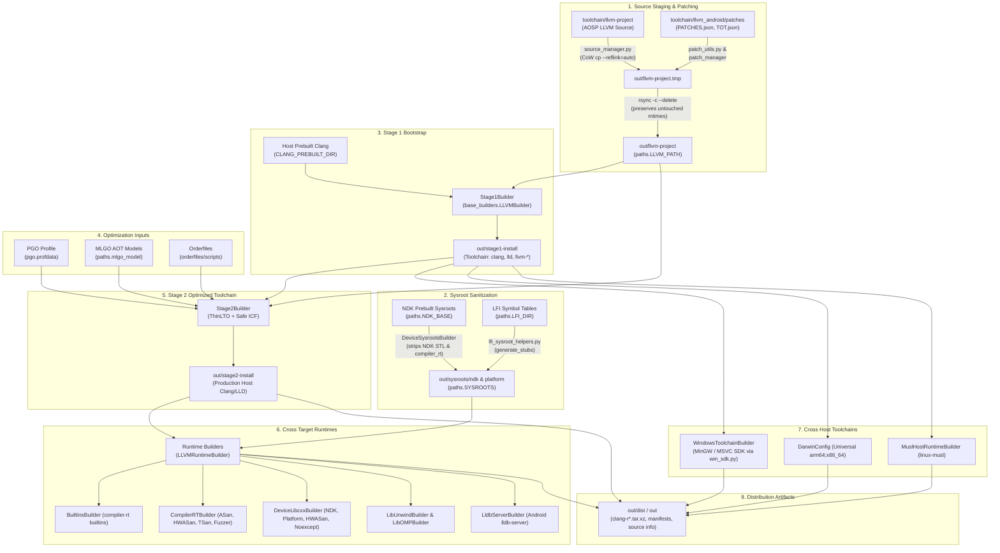

# Android LLVM Toolchain Orchestration Framework (`src/llvm_android`)

## Overview

The `src/llvm_android` package is the core Python orchestration engine for constructing Google's Android LLVM/Clang compiler toolchains and target runtimes. It models multi-stage bootstrapping, cross-compilation target configurations (Android Bionic, Linux glibc/musl, macOS Darwin, Windows MinGW/MSVC, and baremetal embedded architectures), sysroot preparation, downstream patch application, profile-guided and machine-learning optimizations, and distribution artifact generation.

Rather than invoking CMake and Ninja through ad-hoc shell scripts, Android toolchain builds are driven programmatically through an object-oriented builder hierarchy. Top-level drivers (such as `toolchain/llvm_android/do_build.py`) assemble and invoke concrete builder classes registered in `builder_registry.py` against declarative target matrices defined in `configs.py`.

---

## Core Architecture & Data Flow



---

## Primary Component Responsibilities

| Module | Relative Path | Core Responsibilities |
| :--- | :--- | :--- |
| `base_builders.py` | `toolchain/llvm_android/src/llvm_android/base_builders.py` | Abstract builder class hierarchy (`Builder`, `CMakeBuilder`, `AutoconfBuilder`, `LLVMBaseBuilder`, `LLVMBuilder`, `LLVMRuntimeBuilder`, `LibInfo`). Encapsulates CMake variable injection, Ninja target invocation, environment variable synthesis, response file (`@argfile`) generation, and RPATH/SONAME handling. |
| `builders.py` | `toolchain/llvm_android/src/llvm_android/builders.py` | Concrete builder implementations across all pipeline phases: `Stage1Builder`, `Stage2Builder`, `DeviceSysrootsBuilder`, `LFIDeviceSysrootsBuilder`, `DeviceLibcxxBuilder`, `BuiltinsBuilder`, `CompilerRTBuilder`, `MuslHostRuntimeBuilder`, `WindowsToolchainBuilder`, `LldbServerBuilder`, and auxiliary dependency builders (`LibXml2Builder`, `ZstdBuilder`, `XzBuilder`, `LibEditBuilder`, `LibNcursesBuilder`). |
| `builder_registry.py` | `toolchain/llvm_android/src/llvm_android/builder_registry.py` | Central builder registry and discovery mechanism (`BuilderRegistry`). Provides `@BuilderRegistry.register_and_build` method decorator, maintains registered builder instances, and evaluates `--build` / `--skip` target filtering. |
| `configs.py` | `toolchain/llvm_android/src/llvm_android/configs.py` | Multi-platform compilation matrix. Defines platform configurations (`Config`, `_BaseConfig`, `LinuxConfig`, `LinuxMuslConfig`, `DarwinConfig`, `MinGWConfig`, `MSVCConfig`, `AndroidConfig`, `BaremetalConfig`). Manages target LLVM triples, sysroot locations, compilation flags, 16KB page size alignments, and CMake defines. |
| `paths.py` | `toolchain/llvm_android/src/llvm_android/paths.py` | Canonical filesystem anchor resolutions relative to Android repository root (`ANDROID_DIR`, `OUT_DIR`, `DIST_DIR`, `LLVM_PATH`, `SYSROOTS`, `CLANG_PREBUILT_DIR`, `NDK_BASE`, `ORDERFILE_SCRIPTS_DIR`, `LFI_DIR`). |
| `hosts.py` | `toolchain/llvm_android/src/llvm_android/hosts.py` | Target operating system and CPU architecture enumerations (`Host`, `Arch`, `Armv81MMainFpu`) alongside host platform auto-detection (`build_host`, `build_arch`, `build_tag`, `musl_build_tag`). |
| `source_manager.py` | `toolchain/llvm_android/src/llvm_android/source_manager.py` | Staging of LLVM source tree into `paths.LLVM_PATH`. Uses Copy-on-Write (`cp --reflink=auto` on Linux, `cp -c` on Darwin) into a temporary workspace, executes patch application via `external/toolchain-utils`, generates `clang_source_info.md`, and synchronizes into `paths.LLVM_PATH` via `rsync -c --delete` to preserve untouched file modification timestamps. |
| `patch_utils.py` | `toolchain/llvm_android/src/llvm_android/patch_utils.py` | Schema modeling and validation for patch registries (`PATCHES.json`, `TOT.json`). Defines `PatchItem` and `PatchList`, ensuring valid SVN version ranges (`[from, until)`), existence of patch files, and canonical sorting (upstream cherry-picks sorted by `end_version`, followed by local patches). |
| `toolchains.py` | `toolchain/llvm_android/src/llvm_android/toolchains.py` | Standardized wrapper (`Toolchain`) providing unified path accessors for compiler binaries (`cc`, `cxx`, `cl`, `ar`, `ranlib`, `lld`, `lld_link`, `objcopy`, `objdump`, `readelf`, `strip`, `lipo`) and builtin runtime headers across prebuilt and just-built stages. |
| `target_definitions.py` | `toolchain/llvm_android/src/llvm_android/target_definitions.py` | Production CI configuration mappings (`TARGET_DEFS`) specifying CLI driver flags for Linux, Darwin, Linux ARM64, Windows cross-compilation, and bootstrap builds. |
| `lfi_sysroot_helpers.py` | `toolchain/llvm_android/src/llvm_android/lfi_sysroot_helpers.py` | Stubs generator for Linear Function Integrity (LFI) sysroots. Parses symbol export files (`SymbolFileParser`) and produces stub C sources and mock shared libraries (`generate_stubs`, `generate_library`). |
| `win_sdk.py` | `toolchain/llvm_android/src/llvm_android/win_sdk.py` | Windows SDK integration helpers. Manages case-insensitivity on Linux file systems by creating lowercase symlinks for Windows SDK headers and import libraries. |
| `version.py` & `android_version.py` | `toolchain/llvm_android/src/llvm_android/{version,android_version}.py` | Downstream version string parsing, SVN revision numbering (`get_svn_revision_number`), Git SHA provenance tracking, patch-level retrieval, and ToT (`is_llvm_next`) branching switches. |

---

## Key Interfaces & Public Boundaries

### 1. The Builder Lifecycle (`base_builders.Builder`)
All build execution inherits from `Builder` and follows a deterministic sequence:
- `build()`: Decorated by `@BuilderRegistry.register_and_build`. If `BuilderRegistry.should_build(self.name)` returns true, iterates over `config_list` setting `_config` and invoking `_build_config()`, followed by `install()`.
- `_build_config()`: Implemented by `CMakeBuilder` or `AutoconfBuilder`. Prepares output directory (`output_dir`), writes argument files (`cflags`, `cxxflags`), evaluates CMake definitions (`cmake_defines`), executes Ninja, and calls `install_config()`.
- `install()`: Executes post-build operations across all configurations (such as copying shared headers or creating compatibility symlinks).
- `test()`: Executes test suites via Ninja check targets (`check-clang`, `check-llvm`, `check-clang-tools`, `check-cxx-*`).

### 2. Toolchain Encapsulation (`toolchains.Toolchain`)
The `Toolchain` class models an installed LLVM toolset at a given directory path. Downstream stages consume upstream stages through this interface:
```python
# Stage 1 builder uses prebuilt toolchain:
toolchain: toolchains.Toolchain = toolchains.get_prebuilt_toolchain()

# Stage 2 builder consumes stage 1 output:
stage2.toolchain = stage1.installed_toolchain
```

### 3. Declarative Target Configurations (`configs.Config`)
The compilation matrix is defined by specialized configurations that derive from `_BaseConfig`:
- `AndroidConfig`: Specifies target architecture (`ARM`, `AARCH64`, `AARCH64_LFI`, `I386`, `X86_64`, `RISCV64`), target API level (`api_level`), whether the runtime targets the Android platform or NDK (`platform`), and 16KB page size linker flags.
- `LinuxConfig` / `LinuxMuslConfig`: Specifies glibc or musl host runtimes, sysroots, and multilib settings.
- `DarwinConfig`: Targets macOS host universal binaries (`-arch arm64 -arch x86_64`).
- `MinGWConfig` / `MSVCConfig`: Targets Windows host binaries via MinGW-w64 GCC sysroot or MSVC Windows SDK.

---

## Critical Invariants & Architectural Constraints

1. **Incremental Build Safety & Source Tree Invariants**:
   `source_manager.py` never patches `toolchain/llvm-project` directly in-place. Sources are cloned into `paths.OUT_DIR / 'llvm-project.tmp'` using filesystem Copy-on-Write (`--reflink=auto` on Linux, `-c` on Darwin). Patches from `patches/PATCHES.json` are applied to the temporary copy. Only changed files are copied into `paths.LLVM_PATH` using `rsync -r --delete --links -c`. Because `-c` checks content checksums rather than timestamps, unchanged source files retain their original modification dates, preventing unnecessary recompilation in incremental builds.

2. **Sysroot Isolation & STL Sanitization**:
   `DeviceSysrootsBuilder` populates Android sysroots from prebuilt NDK sysroots (`paths.NDK_BASE`). To prevent header collisions and ensure the newly built C++ standard library is used, the builder explicitly purges existing STL headers (`usr/include/c++`) and static/shared library archives (`libc++abi.a`, `libc++_static.a`, `libc++_shared.so`, `libc++.a`, `libc++.so`, `libcompiler_rt-extras.a`, `libunwind.a`). A safety audit verifies these files are completely removed before any runtime targets compile.

3. **16KB Page Size Alignment**:
   In compliance with Android 16KB page-size architecture initiatives, all 64-bit Android configurations (`AndroidX64Config`, `AndroidAArch64Config`, `AndroidAArch64LFIConfig`) mandate:
   ```
   -Wl,-z,max-page-size=16384 -Wl,-z,common-page-size=16384 -D__BIONIC_NO_PAGE_SIZE_MACRO
   ```

4. **Runtime Variants & Exception Handling in Bionic**:
   `DeviceLibcxxBuilder` constructs multiple specialized variants of libc++:
   - Standard Platform & NDK variants.
   - `noexcept` variant (`_is_noexcept = True`): Produces a specialized `libc++_static.a` compiled with exceptions disabled (`-fno-exceptions`). This is strictly required by the Bionic dynamic linker where ELF Thread-Local Storage (TLS) is not yet available for Exception Handling (EH) globals.
   - HWASan variant (`_is_hwasan = True`): Compiled with Hardware-assisted Address Sanitizer instrumentation, linking against the HWASan runtime library.

5. **Optimization Pipeline Coupling**:
   Stage 2 Clang binaries are optimized via a multi-technique pipeline:
   - **ThinLTO**: Enabled via `LLVM_ENABLE_LTO='Thin'`, with `LLVM_PARALLEL_LINK_JOBS` constrained to prevent host memory exhaustion.
   - **Safe ICF**: Linker identical code folding (`-Wl,--icf=safe`) enabled on non-Darwin platforms.
   - **PGO**: Guided by profile data (`LLVM_PROFDATA_FILE`) from prior instrumented profiling runs.
   - **BOLT**: Built with `-Wl,-q` (relocations preserved) to permit post-link reordering by LLVM BOLT.
   - **MLGO**: Pre-trained machine learning models embedded for AOT inlining (`inlining-Oz-chromium`) and register allocation eviction (`regalloc-evict-aosp`).
   - **Orderfiles**: Symbol placement guided via `-Wl,--symbol-ordering-file` to place hot startup routines into contiguous virtual memory pages.

---

> Recorded Revision Hash: c58dd95f2b4669ed109b04b9a2b8e73e1f6f98ef
