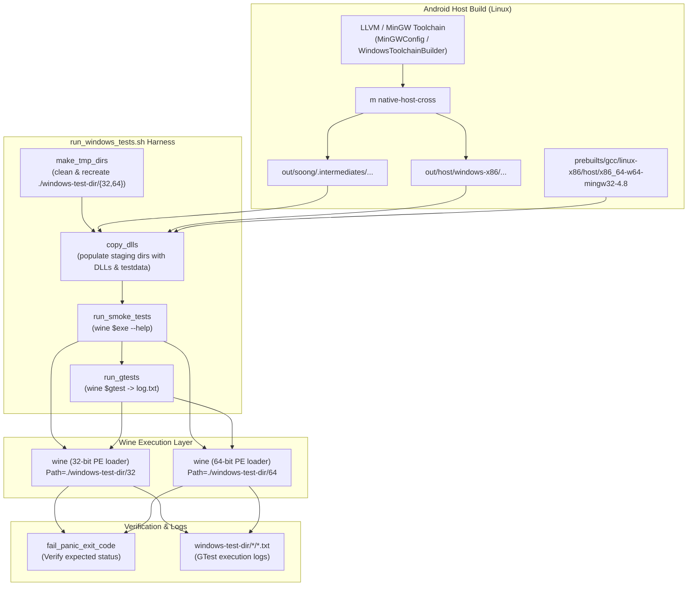

# Architecture Overview: LLVM Android Test Harnesses (`toolchain/llvm_android/test`)

## 1. System Purpose & Toolchain Integration

The `test/` directory in `toolchain/llvm_android` houses integration verification harnesses for validating host binaries generated by the Android LLVM toolchain. Its primary active component is `toolchain/llvm_android/test/platform/run_windows_tests.sh`, an automated Wine execution framework for verifying cross-compiled Windows PE/COFF binaries, dynamic link libraries (DLLs), CLI tools, and unit tests.

### Role in the Toolchain Ecosystem

- **Cross-Compilation Pipeline**: The Android LLVM build infrastructure defines host configurations for Windows in `toolchain/llvm_android/src/llvm_android/configs.py` (`MinGWConfig`) using MinGW GCC 4.8 (`prebuilts/gcc/linux-x86/host/x86_64-w64-mingw32-4.8`) targeting `x86_64-pc-windows-gnu` and `i686-pc-windows-gnu`.
- **Test Exclusion in Host Builds**: In `toolchain/llvm_android/src/llvm_android/builders.py`, `WindowsToolchainBuilder` configures `LLVM_INCLUDE_TESTS = 'OFF'`, meaning standard LLVM internal check suites do not execute natively on the Linux build host for Windows targets.
- **Prebuilt Quality Gate**: As specified in `toolchain/llvm_android/BUILD.md` (Step 5.6: "Manually test on windows"), updating compiler prebuilts requires verifying that Windows host tools produced by Android platform builds (`m native-host-cross`) function correctly under Windows/Wine without loader crashes, relocation faults, or runtime exit-handling regressions.

---

## 2. Component Responsibilities & Execution Pipeline

The harness operates through five sequential stages implemented in `toolchain/llvm_android/test/platform/run_windows_tests.sh`:

1. **Workspace Staging & Hygiene (`clean_tmp_dirs`, `make_tmp_dirs`)**:
   - Removes any existing test artifacts to ensure a pristine execution environment.
   - Creates distinct target staging directories: `./windows-test-dir/32` for 32-bit (`x86`) and `./windows-test-dir/64` for 64-bit (`x86_64`).

2. **DLL Dependency Assembly (`copy_dlls`)**:
   - Copies required runtime DLLs from toolchain prebuilts and Soong/Make intermediate output trees into the respective staging directories:
     - **MinGW Runtime**: `libwinpthread-1.dll` from `prebuilts/gcc/linux-x86/host/x86_64-w64-mingw32-4.8/`.
     - **Android Core Libraries**: `libbase.dll`, `liblog.dll`, `libz-host.dll`, `liblzma.dll`, `libprotobuf-cpp-lite.dll`, `libziparchive.dll`, and `AdbWinApi.dll`.
     - **LLVM / Clang Libraries**: `libclang_android.dll`, `libLLVM_android.dll`, `libbcc.dll`, and `libbcinfo.dll`.
   - Stages test data fixtures (such as `system/libziparchive/testdata`).

3. **Smoke Testing (`run_smoke_tests`)**:
   - Iterates over declarative arrays of 32-bit and 64-bit executables (including `aapt2.exe`, `aapt.exe`, `aidl.exe`, `fastboot.exe`, `dexdump.exe`, `simpleperf_ndk.exe`, `zipalign.exe`, and `split-select.exe`).
   - Configures the Windows search path (`Path=$TMP_DIR_<arch>`) to allow Wine's PE loader to locate staged DLLs.
   - Executes `wine $exe --help` and asserts the expected exit status (0, 1, or 2) using `fail_panic_exit_code`.

4. **Google Test Suite Execution (`run_gtests`)**:
   - Executes cross-compiled Google Test suites under Wine (e.g., `aapt2_tests.exe`, `build_version_test.exe`, `fastboot_test.exe`, `libaapt_tests.exe`, `libbase_test32.exe` / `libbase_test64.exe`, `libsplit-select_tests.exe`, `ziparchive-tests.exe`, and `simpleperf_unit_test.exe`).
   - Directs test stdout to per-binary log files (`windows-test-dir/*/<binary>.txt`) while suppressing stderr noise.
   - Validates termination exit codes against declared expectations (differentiating between clean runs and suites with known failing tests).

5. **Error Assertion Utilities**:
   - `panic()`: Formats error output to stderr and terminates execution with exit code 1.
   - `fail_panic()`: Verifies that the previous shell operation succeeded (`$? == 0`).
   - `fail_panic_exit_code()`: Verifies that a process terminated with its designated expected exit code.

---

## 3. Core Architecture & Data Flow



---

## 4. Key Interfaces & Entry Points

- **Primary Entry Point**:
  ```bash
  toolchain/llvm_android/test/platform/run_windows_tests.sh
  ```
- **Prerequisites**:
  - Wine 64-bit runtime installed on the host system (`wine64` package).
  - Target Windows binaries built via `m native-host-cross` in an Android platform tree.
- **Log Outputs & Analysis**:
  - Detailed GTest logs: `./windows-test-dir/32/*.txt` and `./windows-test-dir/64/*.txt`.
  - Aggregated failure analysis:
    ```bash
    grep "listed below" windows-test-dir/*/*.txt | sed "s/32\// /g" | sed "s/64\// /g" | sort -k 2
    ```

---

## 5. Critical Invariants

1. **Strict Multilib Architecture Isolation**:
   32-bit (`x86`) and 64-bit (`x86_64`) binaries and shared libraries must never be mixed in the same staging folder. Each architecture executes strictly within its own staging directory (`windows-test-dir/32` vs. `windows-test-dir/64`) with an explicitly isolated `Path` environment variable.
2. **DLL Co-location Requirements**:
   Windows PE binaries require runtime DLL dependencies to be immediately resolvable via the executable directory or the `Path` variable. All cross-compiled DLLs (including MinGW's `libwinpthread-1.dll` and core Android runtime libraries) must be pre-copied into the target directory before invoking Wine.
3. **Explicit Expected Exit Statuses**:
   The harness does not assume exit code 0 indicates success for all smoke invocations. Commands like `--help` or tests with known historical failures declare their exact expected return codes (e.g., exit code 1 or 2) in the configuration arrays.
4. **Clean Staging State**:
   Previous test runs are purged before execution (`clean_tmp_dirs`) to avoid false positives or cross-contamination from prior builds.

---

> Recorded Revision Hash: c58dd95f2b4669ed109b04b9a2b8e73e1f6f98ef
